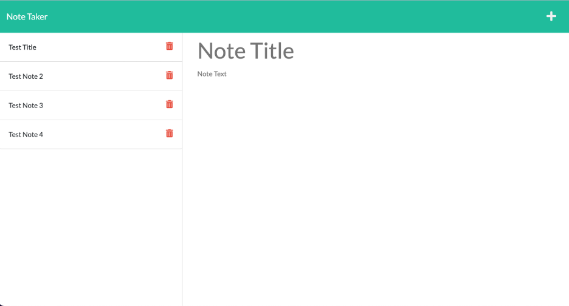

# Caitlin Stevenson|Note Taker Assignment

## Objectives

In this project, I developed the back end for a note taker application. Using Express and UUID Node packages I created api routes in the back end of the application that allow the user to add and save notes.

## User Instruction

A user will need to run npm install in their terminal to get started. Once complete the user will be able to enter the node server.js command in their terminal to turn on the local server.

## Screenshot of Final Page

## Link To The Deployed Page

[Link to final webpage](https://caitlinscodes-note-taker.herokuapp.com/)

## Link To GitHub Repo

[Link to GitHub Repo](https://github.com/caitlinscodes/note_taker)

## License

This code is licensed under the MIT License.